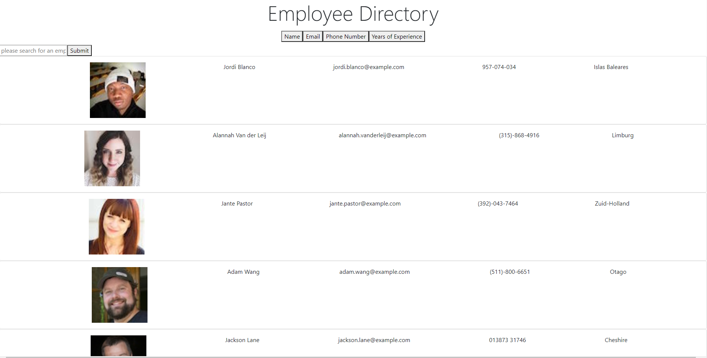

# Employee Directory
The employee directory was a flat React application that used an API call to show various random employees and the User is allowed to sort through these employees either using a search bar and query terms, or through names by Last name sorted alphabetically.

## Getting Started
After creating a new repository I used a create-react-app to make a new react folder with all the starter files, then I coded a base HTML file full of all of my base layout pieces. After creating those pieces I then sorted them into components and started creating my basic directory within my src folder.

### Prerequisites
You have to create a React application and make sure that the proper dependencies are installed before running NPM start. Instantiating react-dom and rendering the public HTML file that gets filled with various components.

### Solving
Solving the Employee Directory required making various types of API calls that displayed information in particular ways either sorted or randomly. That information was then passed through props to various components and rendered in the App.js and sent to the index.HTML where it eventually displayed on the webpage. In order to show the user input and its effect on the searching of various employees, an intial API call for employee data was required as an API in the utils folder and was later used to retreive that employee data from the API of randomusers. Additional functions were required to handle input changes in the search bar for when a user is looking up an employee by name and it sorts the API call data by matching it against the current set state of the user input. Then another function was needed to sort the employees by last name alphabetically and set the state again to the sorted employees.

## Technologies Used

* [JavaScript](https://www.javascript.com/)
* [React](https://reactjs.org/)
* [Bootstrap](https://getbootstrap.com/)
* [Axios](https://www.npmjs.com/package/axios)

## Screenshot 

;

## Authors
* **Thomas Peeler** 

## Github Repository
- [https://github.com/TMPeeler/EmployeeDirectory]

## Deployed Link

- [https://tmpeeler.github.io/EmployeeDirectory/]